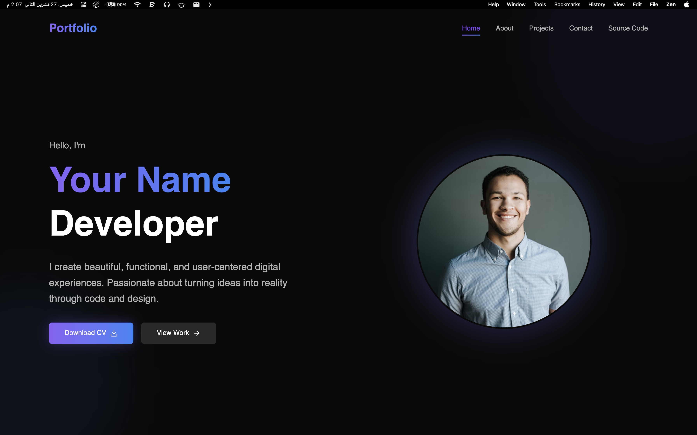
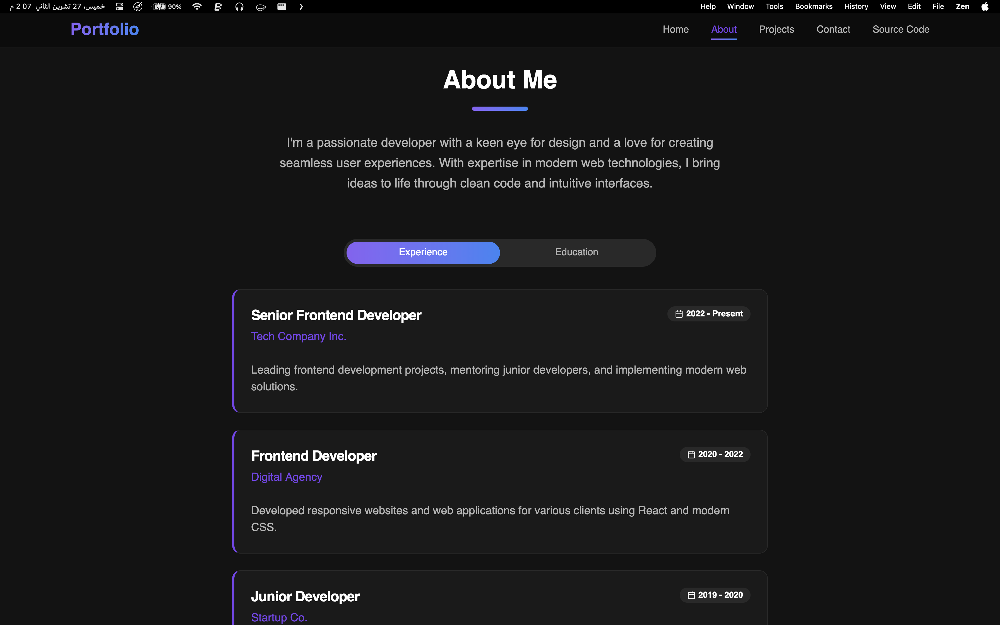
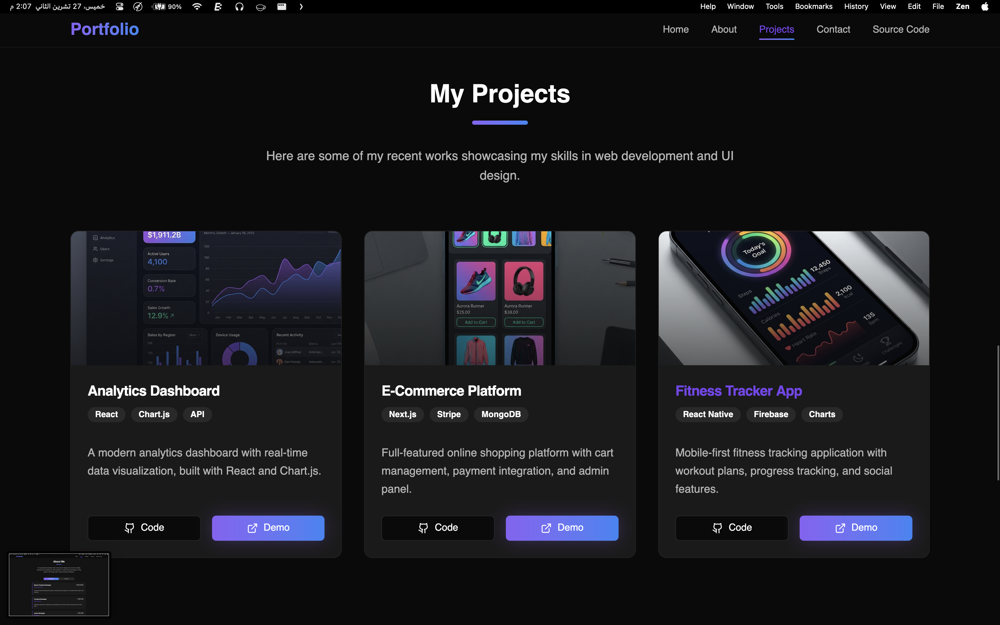
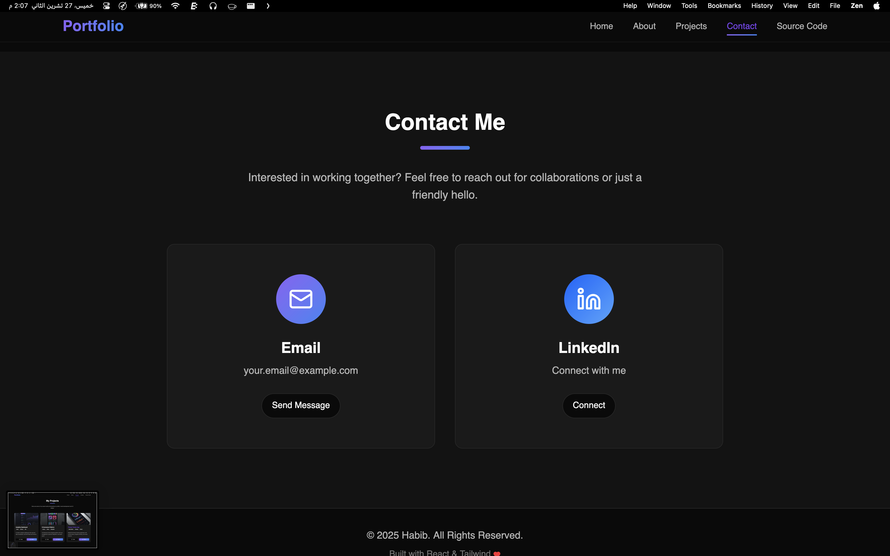

# Modern React Portfolio Template

A sleek, responsive, and high-performance portfolio template built with **React**, **Vite**, **Tailwind CSS**, and **Framer Motion**. Designed for developers and creatives to showcase their work with style.



## 🚀 Features

*   **Modern Design**: Dark mode aesthetic with glassmorphism effects and smooth gradients.
*   **Responsive**: Fully optimized for mobile, tablet, and desktop.
*   **Animations**: Fluid entrance animations and interactions using Framer Motion.
*   **Component-Based**: Modular structure using Reusable UI components (Button, Card, Badge, Tabs).
*   **Performance**: Fast load times powered by Vite.
*   **Clean Code**: Linted with ESLint (React + Hooks rules enabled).

## 🛠️ Tech Stack

*   **Framework**: [React](https://react.dev/) (v19)
*   **Build Tool**: [Vite](https://vitejs.dev/)
*   **Styling**: [Tailwind CSS](https://tailwindcss.com/) (v4)
*   **Icons**: [Lucide React](https://lucide.dev/)
*   **Animations**: [Framer Motion](https://www.framer.com/motion/)
*   **Utils**: `clsx` & `tailwind-merge` for class management.

## 📂 Project Structure

```bash
src/
├── components/
│   ├── sections/    # Page sections (Hero, About, Projects, Contact)
│   └── ui/          # Reusable UI primitives (Button, Card, etc.)
├── lib/             # Utility functions (cn.js)
├── App.jsx          # Main application layout
├── main.jsx         # Entry point
└── index.css        # Global styles & Tailwind directives
```

## 📸 Screenshots

### About Section


### Projects Section


### Contact Section


> **Note**: To see these screenshots, please save the images from the conversation to `public/screenshots/` folder with names: `home.png`, `about.png`, `projects.png`, `contact.png`.

## 🚀 Getting Started

1.  **Clone the repository**
    ```bash
    git clone https://github.com/yourusername/portfolio-react.git
    cd portfolio-react
    ```

2.  **Install dependencies**
    ```bash
    npm install
    ```

3.  **Start the development server**
    ```bash
    npm run dev
    ```

4.  **Build for production**
    ```bash
    npm run build
    ```

## 🎨 Customization

*   **Colors**: Edit `src/index.css` to change CSS variables (primary colors, background, etc.).
*   **Content**: Update text in `src/components/sections/` files.
*   **Projects**: Modify the `projects` array in `src/components/sections/Projects.jsx`.
*   **Resume**: Add your `cv.pdf` file to the `public/` folder to enable the "Download CV" button.

## 📄 License & Rights

This project is licensed under the MIT License with attribution requirements.

**ATTRIBUTION REQUIREMENT:**
Any use, modification, or distribution of this project must include clear attribution to **Ace** visible at the end of the project or in the footer.

## 📬 Contact

*   **Email**: ihabeb330@gmail.com
*   **GitHub**: [Ace](https://github.com/Ace-Bee)
